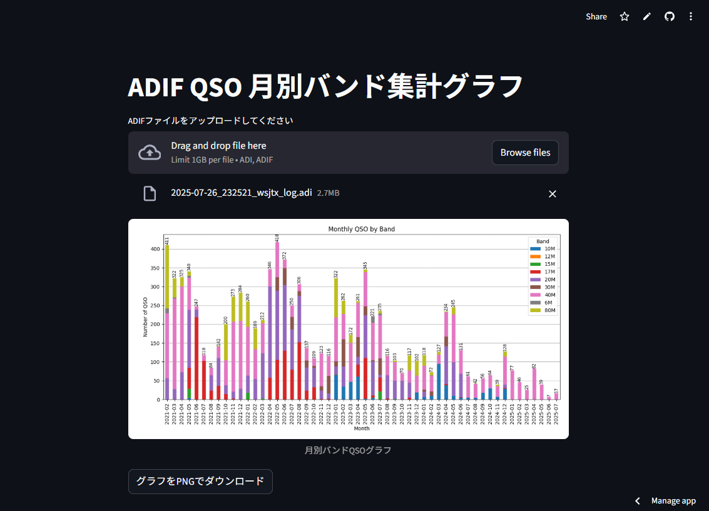
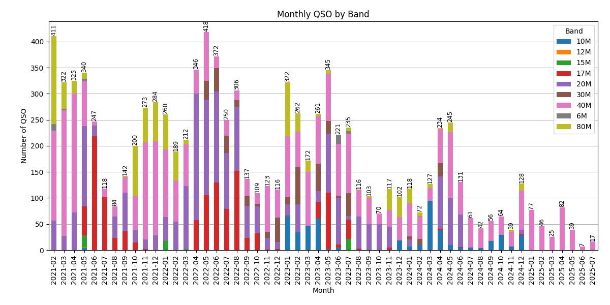

# streamlit-adif-graph

ADIFファイル（アマチュア無線の交信ログ）をアップロードし、月別・バンド別のQSO集計グラフを作成・表示・ダウンロードできるStreamlitアプリです。

動作確認してみたい方はStreamlit Community Cloudの[https://app-adif-graph.streamlit.app/](https://app-adif-graph.streamlit.app/)こちらから。



## 機能
- ADIFファイル（.adi, .adif）をアップロード
- 月別・バンド別QSO数のグラフを自動生成
- グラフ画像（PNG）をダウンロード

## 画面イメージ


## 使い方
1. 必要なPythonパッケージをインストールします。
	```sh
	pip install -r requirements.txt
	```
	※ `adiftools` パッケージはPyPIに存在しない場合、別途ローカルまたは独自リポジトリから入手・配置してください。

2. アプリを起動します。
	```sh
	streamlit run adif_qso_show.py
	```

3. ブラウザで表示される画面からADIFファイルをアップロードしてください。

4. 月別・バンド別QSOグラフが表示され、PNG画像としてダウンロードできます。

## ファイル構成
- `adif_qso_show.py` : Streamlitアプリ本体
- `requirements.txt` : 必要なPythonパッケージ一覧
- `temp_plot.png` : ダウンロード可能なグラフ画像（実行時に生成されます）

## 必要なパッケージ
- `streamlit`
- `matplotlib`
- `adiftools`（`pip install -r requirements.txt`でインストールされます。詳細は[JS2IIU-MH/adiftools-dev](https://github.com/JS2IIU-MH/adiftools-dev)参照。）
  - `adiftools`はバージョン`v0.1.8`以降が必要です。

## ライセンス
[MIT License](LICENCE)

---
Copyright (c) 2025 JS2IIU
